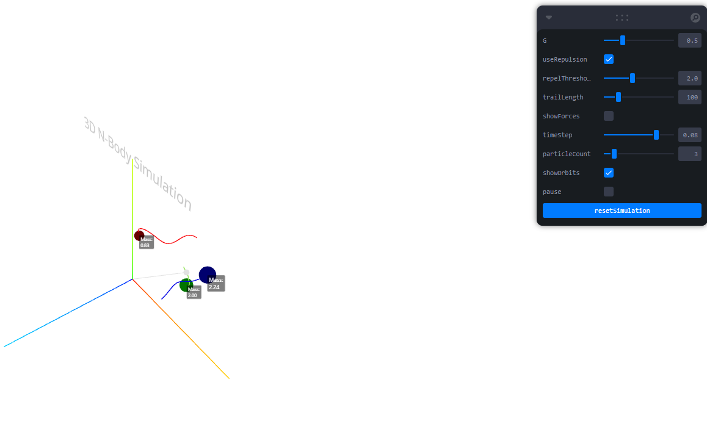

# 3D N-Body Particle System



This project demonstrates a 3D N-Body particle system simulation using **React Three Fiber (R3F)**. The simulation visualizes gravitational interactions between particles, including features such as adjustable particle count, mass-based force calculations, and dynamic visualizations of forces, orbits, and the center of mass.

## Features

### Variable Number of Particles
- Control the number of particles in the system, ranging from 2 to 10.
- Dynamically generate random initial conditions with varying particle velocities and positions.
  
### Particle Mass and Size
- Each particle is assigned a random mass between **0.5** and **2.5**.
- Particle size is proportional to its mass (using cube root scaling).
- Force calculations consider particle mass, simulating gravitational interactions (using the formula: `F = G * m1 * m2 / r^2`).

### Center of Mass Visualization
- The center of mass is calculated and visualized as a white sphere.
- A line from the origin to the center of mass is rendered to provide reference.

### Pause/Resume Functionality
- Toggle to pause and resume the simulation, allowing you to observe individual frames.

### Reset Simulation
- A **"Reset Simulation"** button generates new random initial conditions, offering a fresh start.

### Orbit Toggling
- Show or hide particle trails with the **Orbit Toggle**, visualizing the paths of the particles over time.

### Mass Labels
- Each particle displays its mass above it, offering a quick reference to the particle's gravitational significance.

### Improved Force Visualization
- Arrows represent the forces applied on each particle. The size of the arrow is inversely scaled with particle mass to better illustrate the acceleration caused by the force.

## Getting Started

### Prerequisites

Ensure you have [Node.js](https://nodejs.org/) installed. This project was bootstrapped with **Create React App** and requires **npm** to install dependencies.

### Installation

1. Clone the repository:

   ```bash
   git clone https://github.com/nickverneck/react-threefiber-particles.git

2. Navigate to the project directory: 
     ```bash
    cd react-threefiber-particles

3. Install the required dependencies:
     ```bash
     npm install

### Running the Simulation
To start the development server, run:
    ```bash
    npm start

Open http://localhost:3000 to view the simulation in your browser. The app will automatically reload if you make edits. You will also see any lint errors in the console.


